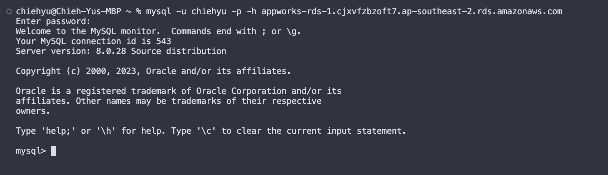

# Remote Assignments
## Description

### Assignment 1 - Understanding Check
1. I make sure that I can connect to my RDS by executing the following command in the terminal :

   ```
   mysql -u chiehyu -p -h appworks-rds-1.cjxvfzbzoft7.ap-southeast-2.rds.amazonaws.com
   ```
    I also tested the connection via dbeaver, below are the screenshots : <br/>

    - connection from ec2<br/>
        
    - connection from local<br/>
         <br/>
        
        


2. Without Elastic IP, the public IP address of an EC2 instance will change on instance reboot, since AWS dynamically assigns public IP addresses to EC2 instances from a pool of available addresses.

3. The purpose of using Elastic IP is to associate a static and persistent public address to EC2 instance and avoid IP changes on system reboot.
### Assignment 3 - Observations
1. Below are the screenshots in step 4 respectively :
   - Synchronous Result <br/>
        
   - Asynchronous Result <br/>
        
    
1. The key difference between synchronous and asynchronous functions is that synchronous functions execute in sequence so it spends more time processing the three requests, while asynchronous functions can process in parallel resulting in shorter execution time.
   
2. Asynchrounous functions are useful when a program needs to process many tasks at the same time. For example, it needs to request data from different routes, perform some post-processing to the data and receive inputs from the user. If we use asynchronous functions, the user experience would be better.
   
3. Comparison between the 3 ways : 

    | Method        | Pros                                                                                                 | Cons                                                                               |
    | ------------- | ---------------------------------------------------------------------------------------------------- | ---------------------------------------------------------------------------------- |
    | Callback      | - Simple to write and understand                                                                     | - May lead to callback hell <br/> - More callback functions will be harder to read |
    | Promise       | - Chain async operations in a more readable way <br/> - Built-in error handling with catch           | - The implementing details are more complex                                        |
    | Async & Await | - More readable and concise compared to the other two <br/> - Built-in error handling with try-catch | - Only supported in modern environments                                            |

## Environment Requirements
Below is the environment I'm using : 
- Node.js v18.17.1
## How to Use
Run `requestSync.js` and `requestAsync.js` with the following commands :
```
time node requestSync.js
time node requestAsync.js
```
