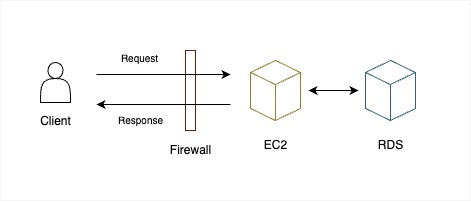

# Remote Assignments Week 2
## Description

### Understanding Check
1. Below is the schema of my user table
   
   ```sql
   CREATE TABLE user (
        id           INT           AUTO_INCREMENT PRIMARY KEY,
        name         VARCHAR(45)   NOT NULL,
        email        VARCHAR(45)   NOT NULL UNIQUE,
        password     VARCHAR(100)  NOT NULL,
        created_at   TIMESTAMP     NOT NULL
   );
   ```
    I used auto incremented id to be the primary key and set a unique constraint on field, email, so that the email for different users would not be the same.

2. HTTP status code tells the client about the status of the request's result, for example, it might be successful, failed due to server errors or the client is unauthorized. While it is technically possible to not use status codes in our response, but it is highly recommended to use to help developers handle the responses properly.

    Different status codes have different meanings, for example :

    | Code Group | Meaning                |
    | ---------- | ---------------------- |
    | 1xx        | informational response |
    | 2xx        | success                |
    | 3xx        | redirection            |
    | 4xx        | client errors          |
    | 5xx        | server errors          |
   
3.  I test my APIs with the Postman application. I added a collection of the APIs in this assignment and declared some environment variables like local_ip and ec2_ip to help me test the same routes under different environments.

4.  I choose to install the forever CLI tool to run and stop my app server in the background by the following commands :
    ```
    forever start app.js
    forever stop app.js
    ```
    so that I can ensure that my app would not shut down even if the ssh connection exits.

5.  The client sends a request to the public ip of the EC2 instance (app server). The firewall contains some inbound rules and outbound rules to see if the client can access the instance. When processing the request, the app server interacts with RDS to retreive or store data. See the diagram below : <br/><br/>
   

6.  My app listen to port 80, so that my client don't need to specify the port number.
   
7.  The web server delivers static web content in response to an HTTP request, while the application server can generate and deliver dynamic content related to business logic.

## Environment Requirements
Below is the environment I'm using : 
- Node.js v18.17.1
- npm v10.2.0

## How to Use
### Install the dependencies
```
cd week2
npm install
```
### Run the app server
```
node app.js
```
### Run the app server in the background
```
forever start app.js
forever stop app.js

# you might have to install forever globally first
npm install forever -g
```
